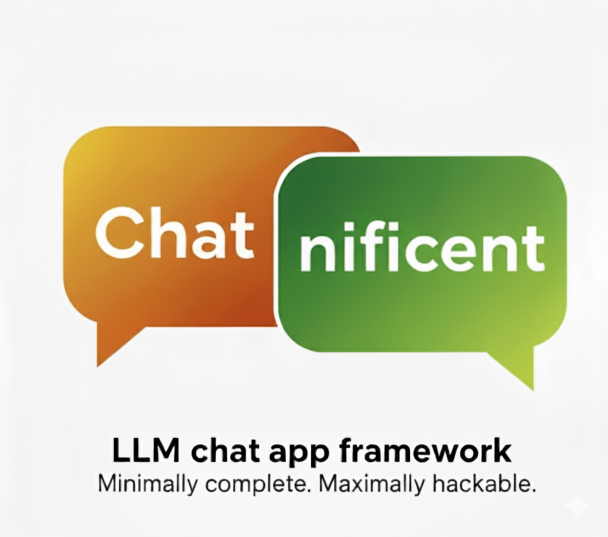

# Chatnificent

**LLM chat app framework. Minimally complete. Maximally hackable.**

[](https://pypi.python.org/pypi/chatnificent) [](https://deepwiki.com/eliasdabbas/chatnificent)

Pre-built chat UIs give you a working app but almost no way to customize it. Building from scratch gives you full control but means wiring up a UI, LLM client, message store, streaming, auth, and tool calling yourself.

Chatnificent is a Python framework where each of those concerns is an independent, swappable component. You get a working app immediately. When you need to change something — the LLM provider, the database, the entire UI — you swap one component, instead of rewriting the whole app.

## Quickstart

```bash
pip install chatnificent
```

```python
import chatnificent as chat

app = chat.Chatnificent()
app.run()  # http://127.0.0.1:7777
```

No API keys, no extras, no configuration. You get a working chat UI with the built-in Echo LLM, a stdlib HTTP server, and an HTML/JS frontend — all with zero dependencies.

## One Install Away from Real LLM Responses

```bash
pip install openai
export OPENAI_API_KEY="sk-..."
```

Run the same code. Chatnificent auto-detects the installed OpenAI SDK and your API key — no code change needed.

## Swap Anything

Every component is a pillar you can swap independently:

```python
import chatnificent as chat

# Different LLM providers
app = chat.Chatnificent(llm=chat.llm.Anthropic())   # pip install anthropic
app = chat.Chatnificent(llm=chat.llm.Gemini())       # pip install google-genai
app = chat.Chatnificent(llm=chat.llm.Ollama())       # pip install ollama (local)

# Persistent storage
app = chat.Chatnificent(store=chat.store.SQLite(db_path="chats.db"))
app = chat.Chatnificent(store=chat.store.File(base_dir="./conversations"))

# Mix and match
app = chat.Chatnificent(
    llm=chat.llm.Anthropic(),
    store=chat.store.SQLite(db_path="conversations.db"),
    layout=chat.layout.Bootstrap(),  # Requires: pip install "chatnificent[dash]"
)
```

## Streaming by Default

All LLM providers stream by default — token-by-token delivery via Server-Sent Events. Opt out with `stream=False`:

```python
app = chat.Chatnificent(llm=chat.llm.OpenAI(stream=False))
```

## The Architecture: 9 Pillars

Every major function is handled by an independent pillar with an abstract interface:

| Pillar | Purpose | Default | Implementations |
| :--- | :--- | :--- | :--- |
| **Server** | HTTP transport | `DevServer` (stdlib) | DevServer, DashServer |
| **Layout** | UI rendering | `DefaultLayout` (HTML/JS) | DefaultLayout, Bootstrap, Mantine, Minimal |
| **LLM** | LLM API calls | `OpenAI` / `Echo` | OpenAI, Anthropic, Gemini, OpenRouter, DeepSeek, Ollama, Echo |
| **Store** | Persistence | `InMemory` | InMemory, File, SQLite |
| **Engine** | Orchestration | `Orchestrator` | Orchestrator |
| **Auth** | User identification | `Anonymous` | Anonymous, SingleUser |
| **Tools** | Function calling | `NoTool` | PythonTool, NoTool |
| **Retrieval** | RAG / context | `NoRetrieval` | NoRetrieval |
| **URL** | Route parsing | `PathBased` | PathBased, QueryParams |

Dash-based layouts (Bootstrap, Mantine, Minimal) require `pip install "chatnificent[dash]"` and the `DashServer`.

## Customize the Engine

The `Orchestrator` manages the full request lifecycle: conversation resolution, RAG retrieval, the agentic tool-calling loop, and persistence. Override hooks (for monitoring) and seams (for logic):

```python
import chatnificent as chat
from typing import Any, Optional

class CustomEngine(chat.engine.Orchestrator):

    def _after_llm_call(self, llm_response: Any) -> None:
        tokens = getattr(llm_response, 'usage', 'N/A')
        print(f"Tokens: {tokens}")

    def _prepare_llm_payload(self, conversation, retrieval_context: Optional[str]):
        payload = super()._prepare_llm_payload(conversation, retrieval_context)
        if not any(m['role'] == 'system' for m in payload):
            payload.insert(0, {"role": "system", "content": "Be concise."})
        return payload

app = chat.Chatnificent(engine=CustomEngine())
```

## Build Your Own Pillars

Implement the abstract interface and inject it:

```python
import chatnificent as chat
from chatnificent.models import Conversation

class MongoStore(chat.store.Store):
    def save_conversation(self, user_id, conversation): ...
    def load_conversation(self, user_id, convo_id): ...
    def list_conversations(self, user_id): ...

app = chat.Chatnificent(store=MongoStore())
```

Every pillar works the same way: subclass the ABC, implement the required methods, pass it in.

## Can't Wait? Try It Right Now

No cloning, no installing — just [install uv](https://docs.astral.sh/uv/getting-started/installation/) and run any example directly from GitHub:

> **Note:** Most examples require LLM provider API keys. Set the ones you need before running:
> ```bash
> export OPENAI_API_KEY="sk-..."
> export ANTHROPIC_API_KEY="sk-ant-..."
> export GOOGLE_API_KEY="AI..."
> export OPENROUTER_API_KEY="sk-or-v1-..."
> ```
> `quickstart.py` and `persistent_storage.py` work with zero keys (Echo LLM).

```bash
# Zero-dep — works immediately
uv run --script https://raw.githubusercontent.com/eliasdabbas/chatnificent/main/examples/quickstart.py

# LLM providers
uv run --script https://raw.githubusercontent.com/eliasdabbas/chatnificent/main/examples/llm_providers.py
uv run --script https://raw.githubusercontent.com/eliasdabbas/chatnificent/main/examples/ollama_local.py
uv run --script https://raw.githubusercontent.com/eliasdabbas/chatnificent/main/examples/openrouter_models.py

# Features
uv run --script https://raw.githubusercontent.com/eliasdabbas/chatnificent/main/examples/persistent_storage.py
uv run --script https://raw.githubusercontent.com/eliasdabbas/chatnificent/main/examples/tool_calling.py
uv run --script https://raw.githubusercontent.com/eliasdabbas/chatnificent/main/examples/system_prompt.py
uv run --script https://raw.githubusercontent.com/eliasdabbas/chatnificent/main/examples/multi_tool_agent.py

# Customization
uv run --script https://raw.githubusercontent.com/eliasdabbas/chatnificent/main/examples/single_user.py
uv run --script https://raw.githubusercontent.com/eliasdabbas/chatnificent/main/examples/auto_title.py

# Display enrichment
uv run --script https://raw.githubusercontent.com/eliasdabbas/chatnificent/main/examples/usage_display.py
uv run --script https://raw.githubusercontent.com/eliasdabbas/chatnificent/main/examples/usage_display_multi_provider.py
uv run --script https://raw.githubusercontent.com/eliasdabbas/chatnificent/main/examples/conversation_title.py
uv run --script https://raw.githubusercontent.com/eliasdabbas/chatnificent/main/examples/conversation_summary.py
uv run --script https://raw.githubusercontent.com/eliasdabbas/chatnificent/main/examples/display_redaction.py
uv run --script https://raw.githubusercontent.com/eliasdabbas/chatnificent/main/examples/web_search.py

# Starlette server (requires OPENAI_API_KEY)
uv run --script https://raw.githubusercontent.com/eliasdabbas/chatnificent/main/examples/starlette_quickstart.py
uv run --script https://raw.githubusercontent.com/eliasdabbas/chatnificent/main/examples/starlette_server_options.py
uv run --script https://raw.githubusercontent.com/eliasdabbas/chatnificent/main/examples/starlette_uvicorn_options.py
uv run --script https://raw.githubusercontent.com/eliasdabbas/chatnificent/main/examples/starlette_multi_mount.py
```

## Examples

The [`examples/`](examples/) directory has 20 standalone scripts covering basics, tool calling, display enrichment, web search, and more — each runnable with a single command:

```bash
uv run --script examples/quickstart.py
```

See the [examples README](examples/README.md) for the full list.
